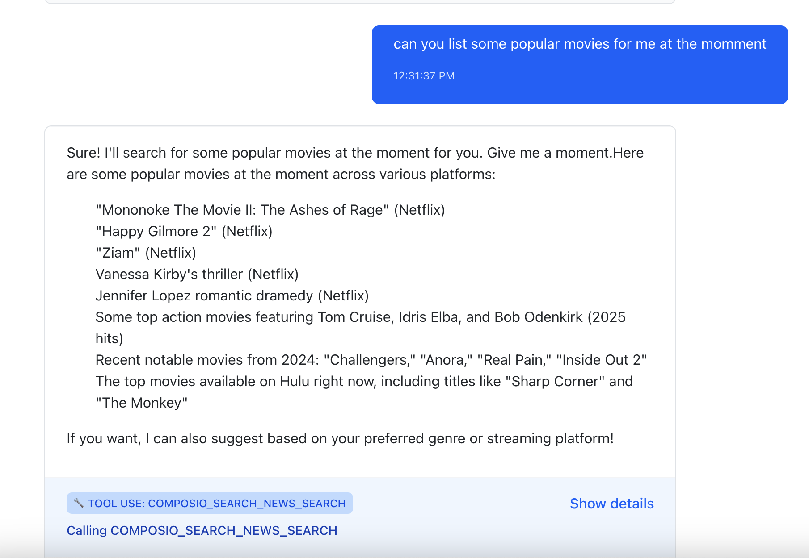
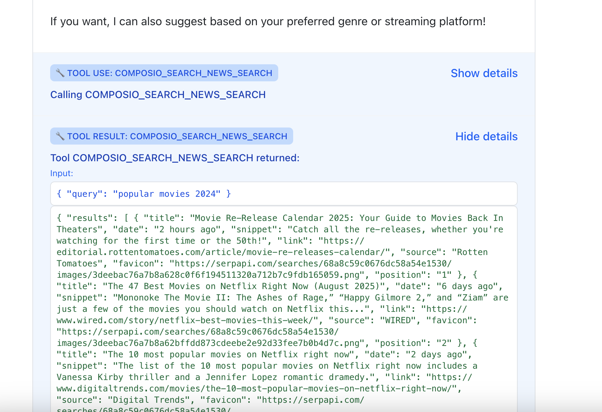
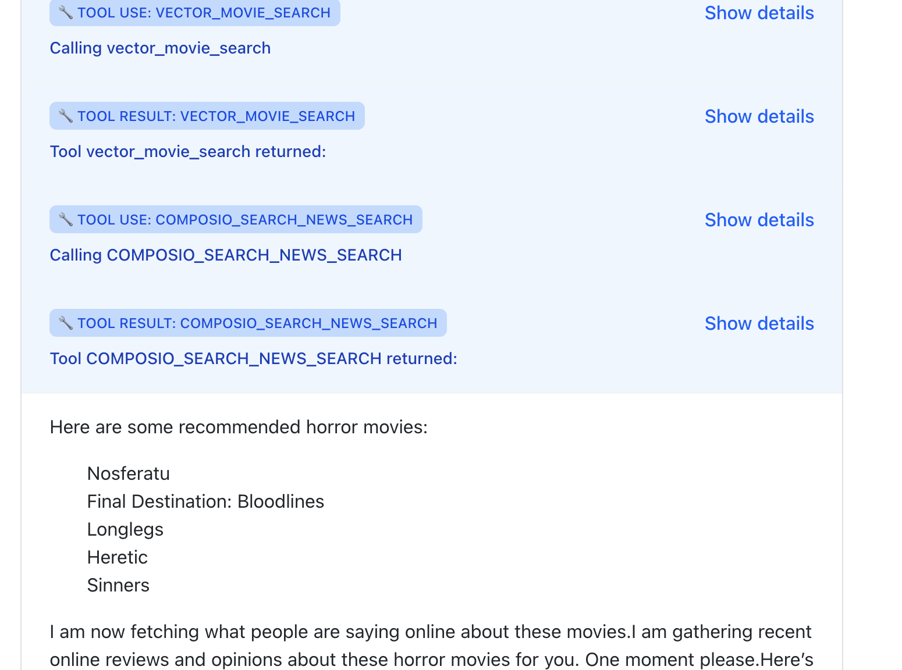

# Project Description

A simple chatbot that uses retrieval augmented generation (RAG) to recommend movies to a user. This project uses flask, react typescript, Postgres, pgvector and docker.

It is a simple chat interface where a user can ask to get movies recommended. The agent will then use a tool to search in a vector database similar movies to those of the interest of the user. It will then return those movies to the user.

Additionally the chatbot is equipped with tools to search news or search google for current movies and tell the user about them.

# How to Run

First ensure you set your OpenAI api key in the `.env` file in the `backend`. Then docker should take care of the rest

```sh
docker compose up --build
```

Then you can go to local host and you should be able to chat

# Demo

Searching popular movies





Recommending Movies



